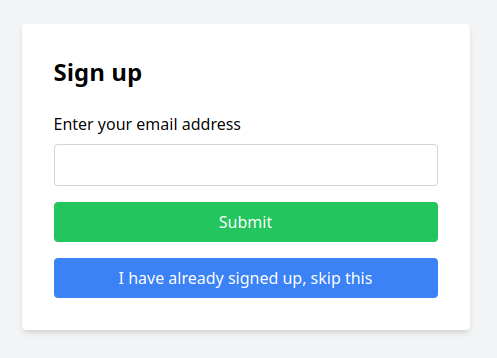
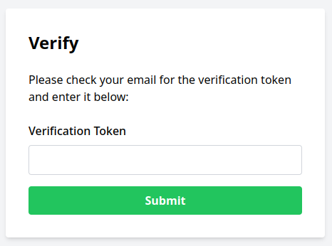
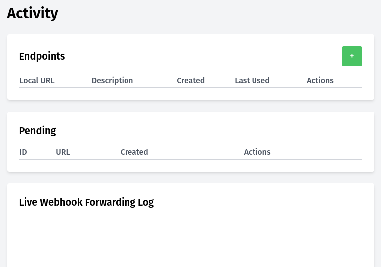
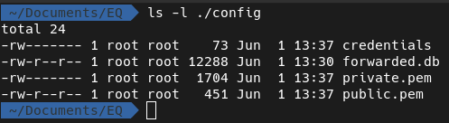
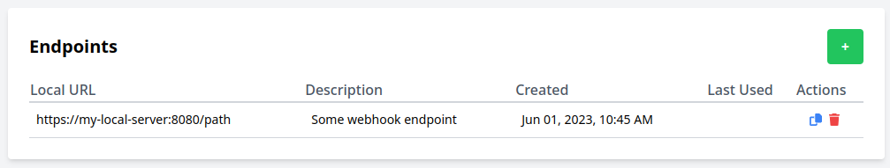
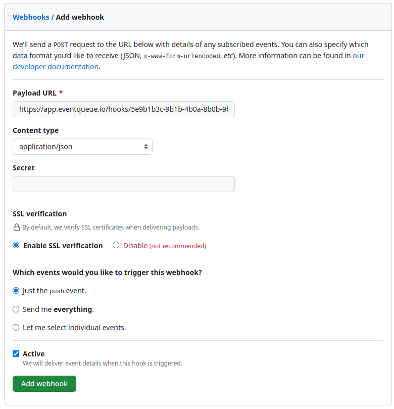

# EventQueue Local Agent

EventQueue is a SaaS platform that stores and forwards webhooks.
Compared to other similar services, EventQueue is very simple in that it is single-user, it
does not offer analytics, and the UI is fairly minimal. However, it differentiates itself by
emphasizing [security](#security) and [privacy](#privacy).

## Why? And how does it work?

I had a use case where I wanted to receive webhooks on my home server,
but a) I don't trust my Internet connection to be always available, b) I don't want to open
a port on my firewall, and c) don't want to store the webhook's content unencrypted on a 3rd
party service.

EventQueue works with a public-facing service that receives/encrypts/stores the
webhooks, and an agent that you run on your own infrastructure that connects to the service
and retrieves the content for the webhooks you have configured.

## What is this repo?

This is the repository for the local agent that runs on your own server and connects to the
EventQueue service. It is open source, written in  the Python programming language and uses 
Vue.js for a *very* minimal UI. It is distributed by means of a docker image, but you can 
always run it off the original source in this repository if you prefer. If you decide to do so,
you need to remember to set the following environment variables:
- `ENVIRONMENT="production"`
- `CENTRAL_URL="https://app.eventqueue.io"`

Please note that this has been tested only on Linux, and amd64/arm64 architectures. It may or may
not run on other architectures.

## Current limitations - please read carefully!

- Only a single user is supported per agent. _There is no authentication for the agent_, it's open to
  everyone who has access to the network that it runs on. **SO MAKE SURE THAT OTHERS CANNOT ACCESS IT**.
  I suggest that if you don't know how to do that, don't use EventQueue in its current form. 
- No authentication is supported for the incoming webhooks. This means that _you must be cautious
  with the public endpoint that EventQueue provides, and not share it publicly_: anyone who knows it
  can send HTTP calls that may contain malicious payloads, and will be forwarded to your local server.
- If you lose your credentials, there is no way to get them back or reset them. You will need to
  create a new account and reconfigure all your webhooks. I'm planning to add reset functionality soon.
- While this is in beta, you can only receive up to 100 webhooks per day. If that number is 
  reached then excess webhooks are rejected. This is to avoid abuse of the service during this
  test phase, and will change in the near future.
- During beta testing I've limited the number of available user accounts. If the number is reached
  you will be asked whether you want to be notified when more user accounts open up. 

## Security

The way that EventQueue is more secure than other services is that it does not require you to
open a port on your firewall. Instead, it uses a local agent that you run on your own server,
that connects to the EventQueue servers over HTTPS and receives SSE-powered updates. This means that 
you can run EventQueue on a server that is behind a firewall, and you can even run it on your
own laptop if you want.

## Privacy

EventQueue is also more private than other services because it does not store any of your webhook
content unencrypted. In fact, *it will refuse to accept webhooks unless you have successfully
set up a public key for your account* (the local agent will do this for you automatically). If you
ever rotate the keys that the agent creates for you, you'll need to update the public key in the
server, and you could end up with a few messages that can't be decrypted anymore.

EventQueue employs a hybrid encryption scheme, as public key encryption cannot be used for
large enough payloads. The way it works is that upon receipt of a webhook the EventQueue
server generates a random symmetric key, encrypts the payload with that key, and then encrypts
the symmetric key with your public key. This is the first thing that happens upon receipt of
a webhook, before any other processing, and the original payloads are immediately discarded.

The encrypted payload and encrypted symmetric key are then stored in a database, and if the
local agent is connected they are sent over via Server-Side Events (SSE). The local agent then
decrypts the symmetric key with the private key, and the payload with the
symmetric key, before submitting the original, unencrypted payload to local services.

## Safety

Deletion of webhook content from the central database will only take place after the
local agent has successfully stored payloads locally in a SQLite database. After the content is 
deleted from the central EventQueue database, there is no way to retrieve it again from the
central service; it's gone forever. Which is why it's important that you never delete the
SQLite database that the local agent uses to store payloads.

The agent and the overall system has a number of ways to ensure delivery *eventually*. If
the agent is offline for a period of time, when it connects it will receive the full backlog
to process. Any webhook that cannot be delivered locally will be marked as undelivered,
and you can request a retry via the UI of the local agent. Data is never deleted from the local
SQLite database, only marked as delivered to avoid double delivery.

## Installation

The easiest way to install the local agent is to use the docker image. You can find it in
the GitHub container registry and run it as follows:

```
docker run -p 8000:8000 -v ./config:/app/config ghcr.io/eventqueue-io/eq-agent:0.1.1
```

You can then access the UI at http://your-local-server:8000/ and you will be guided through
the setup process. The first thing you'll be asked to do is to signup, providing your email
address:



When you hit "submit", if your email validates correctly **(and there are available account slots,
while in beta)** you will be redirected to a page  that asks you to check your email for a 
verification token. In case there are no private beta slots available, you will be asked to opt-in
to a waiting list.



You should receive an email with a verification token, which you can then enter in that form.
If the token is valid, you will be redirected to a page where you can see a list of your
configured webhooks, as well as a live log of all forwarded calls:



Behind the scenes, a couple more things have happened by now:

1. A set of credentials has been created for your user, and stored under the `./config`
directory with user-only read/write permissions. *This is essentially your username and
password for all API calls, and it's stored in cleartext, so please make sure it remains
accessible only to you*.
2. A public/private key pair has been generated for your user, and the public key has been
sent to the EventQueue server. The private key has been stored under the `./config` directory
with user-only read/write permissions. *This is used to decrypt webhook payloads, so please
make sure it remains accessible only to you*.
3. A SQLite database has been created under the `./config` directory. Don't remove it after
you start accepting webhooks, as it's used to avoid double delivery of webhooks.
Also, it maintains webhook payloads that are deleted from the central service, so if a local
endpoint is unavailable and you delete the SQLite database, those payloads will never be delivered.

This is what your `config` directory should look like:



## Configuration

After this first setup, you can add webhooks by clicking on the "+" button in the top right
corner of the webhooks page. You will be asked to provide the private URL where calls should
be forwarded, and a description. It is fine if that private URL is a name such as `my-server`,
as long as it resolves on the local network. Private IP addresses such as `192.168.1.100` are
also just fine.



You can delete configured webhooks by clicking on the red trash-bin icon.

If you click on the "copy" icon, the "public" endpoint for your webhook will be copied to your
clipboard. It will look something like this:

```
https://app.eventqueue.io/hooks/5e9b1b3c-9b1b-4b0a-8b0b-9b0c1b0b1b0b
```

*Please note that for the `copy` functionality to work, the UI must be served 
over HTTPS, or from the localhost.* If you are accessing the UI over plain HTTP
on a server other than localhost, one option is to open a SSH tunnel as follows
and visit the UI on `http://localhost:8080`:

```
ssh -L 8080:my-server:8000 my-server
```

You can provide the copied URL to any service that supports webhooks. For example, if you want to 
configure GitHub to send webhooks to EventQueue, you can do so by going to the "Settings"
of a repository, and then clicking on "Webhooks":



From this point all, all webhooks from GitHub will be submitted to EventQueue, encrypted,
and forwarded to your local server. You can see the calls in the log, and you can also see
retries when some local delivery fails.

It's worth repeating that, at this moment, webhook secrets are not supported. So you 
should treat the EventQueue public endpoint with caution, and not
reference it publicly. *If you do, anyone can make HTTP calls to it and those
potentially invalid or malicious calls will be forwarded to your local server*.

## Future plans

- Support for webhook secrets
- Support for multiple users & authentication on the local agent
